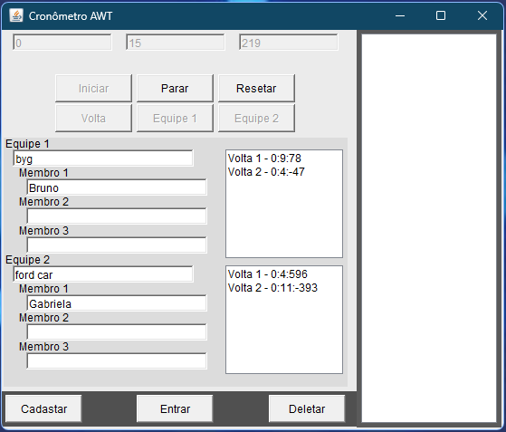

# Portifolio

## Cronometro BandG

[](https://github.com/bruno-campos-lacerda/BandG/tree/master)
[]()

>Projeto do terceiro periodo de Ciências da Computação, se trata de um sistema que registra equipes, membros e tempo de voltas em um banco de dados, tendo sua interface construida com a biblioteca AWT

### Objetivo do projeto
- Desenvolver habilidades de programação orientada a objetos
- Entender a plataforma GitHub para armazenamento e versionamento de projeto
- Desenvolver o uso e conexão com banco de dados
- Criar uma interface simples e intuitiva para o usuario final



### 📁Estrutura do projeto

```bash
BYG/
├── src/byg/
│   ├── AtualizadorTela.java # interface com atualizar tempo
│   ├── Cronometro.java # Interface para usuario
│   ├── TeamLogin.java # Objeto Equipe
│   └── Temporizador.java # Cronometro funcional
├── mysql-connector-j-9.3.0/
│   └── mysql-connector-j-9.3.0.jar # conetor com banco de dados
└── byg.sql # banco de dados
```

### ▶️ Como executar o programa
- Clonar repositorio e abrir no netBeans
- importar byg.sql
- Adicionar mysql-connector no Services/Databases e configurar conexão para byg
- executar Cronometro.java


## Comparador de imagens

## Outer Space

## Castle Board

## Macabra

## Spiegel Wasser